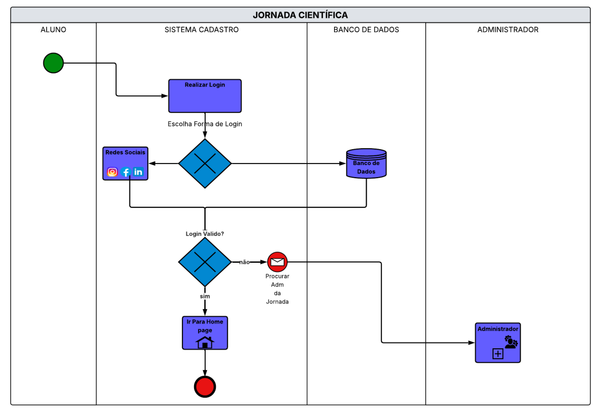
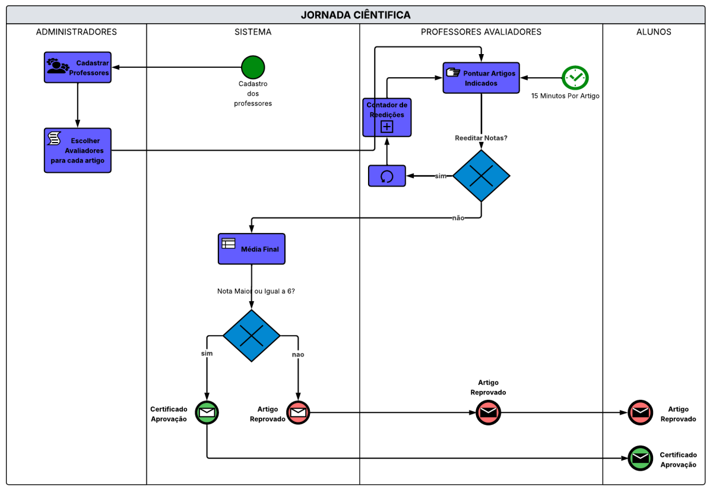

# 🎓 Projetos Acadêmicos - ADS (Centro Universitário São Lourenço)

Este repositório centraliza minha jornada acadêmica no curso de **Análise e Desenvolvimento de Sistemas**. Aqui documento o desenvolvimento de competências técnicas em programação e banco de dados, integradas a uma visão estratégica de processos e governança de TI.

---

## 🏆 Projeto de Destaque: Modelagem do Sistema "Jornada Científica"

Mapeamento completo dos processos de um portal de eventos acadêmicos utilizando a notação **BPMN**. Este trabalho demonstra minha capacidade de estruturar regras de negócio complexas e fluxos de automação.

### 📊 Processos Mapeados:
1. **Autenticação:** Login via Redes Sociais ou Banco de Dados Acadêmico.
2. **Inscrição em Eventos:** Seleção de palestras e minicursos para usuários autenticados.
3. **Submissão de Artigos:** Fluxo de upload de arquivos PDF por alunos responsáveis.
4. **Avaliação e Certificação:** Regra de aprovação automática (média ≥ 6) e emissão de certificados.

### 🖼️ Visualização dos Fluxos:

  
  

---

## 📂 Estrutura do Repositório

### 💻 [01-logica-e-algoritmos](./01-logica-e-algoritmos)
Fundamentos de lógica desenvolvidos em **Portugol**, consolidando conceitos de estruturas de decisão e repetição.
- **Imobiliária Imóbilis:** Algoritmo para cálculo de área de terrenos retangulares.
- **Gestão de Posto:** Lógica de venda com descontos progressivos para Álcool e Gasolina.
- **Controle de Estoque:** Automação de levantamento de valores e média de mercadorias.

### 🏢 [02-gestao-e-governanca](./02-gestao-e-governanca)
Aplicação de boas práticas baseadas na biblioteca **ITIL** para gerenciamento de serviços.
- **Catálogo de Serviços TI:** Estruturação de 18 serviços com foco em **SLAs** (Service Level Agreement) por criticidade.
- **Foco no Cliente:** Definição de canais de solicitação claros e linguagem centrada no usuário.

### 📊 [03-modelagem-de-processos-bpm](./03-modelagem-de-processos-bpm)
Mapeamento de fluxos lógicos e regras de negócio utilizando **Lucidchart**.
- **Venda de Passagens Aéreas:** Fluxo completo desde a origem até a emissão do bilhete.
- **Controle de Cursos:** Atendimento, matrícula e verificação de cadastro.
- **Locação de Fitas:** Lógica de verificação de pendências e registro de locação.

### 🗄️ [04-bank-de-dados](./04-banco-de-dados)
Projetos de estruturação e manipulação de dados utilizando **SQL (MySQL)**.
- **Sistema Hospitalar:** Criação de tabelas (DDL) e inserção de dados (DML) para Médicos, Pacientes e Exames.
- **Gestão de Contas e Associados:** Consultas complexas com `INNER JOIN`, cálculos de multas e reajustes baseados no índice IGPM.

---

## 🛠️ Competências em Destaque
- **Analista de Automação:** Visão crítica para transformar processos manuais em fluxos digitais eficientes.
- **Desenvolvimento Back-end:** Domínio inicial de lógica e manipulação de bancos de dados relacionais.
- **Governança de TI:** Gestão de níveis de serviço e entrega de valor ao negócio.

**📍 João Pedro Faria** | Virgínia - MG  
[LinkedIn](https://www.linkedin.com/in/joaopedronevesfaria)
